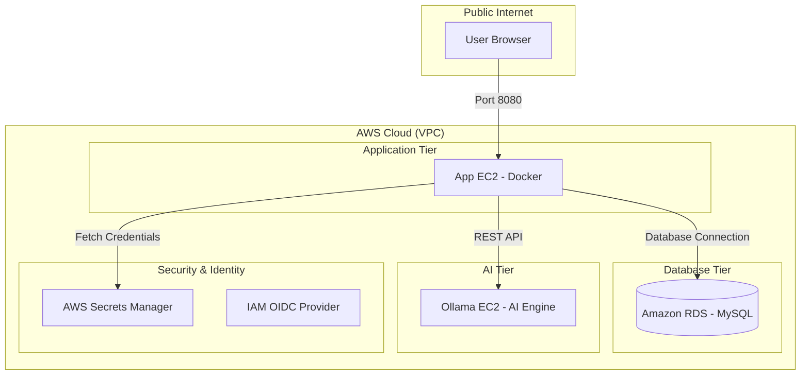

<div align="center">

# 🏦 DevSecOps Banking Application (Master Guide)

A high-performance, containerized banking application built with **Spring Boot 3**, **Java 21**, and **Integrated AI (Ollama)**. This repository provides a complete "Golden Pipeline" setup following modern DevSecOps best practices.

[](https://www.oracle.com/java/technologies/javase/jdk21-archive-downloads.html)
[](https://spring.io/projects/spring-boot)
[](.github/workflows/devsecops.yml)
[](#phase-2-security--identity-iam-oidc)

</div>

---

## 🏗️ Architecture Overview

The system follows a multi-tier, secure architecture deployed on AWS:



---

## 🚀 Setup & Deployment Guide

Follow these five phases to implement the project exactly as documented.

### Phase 1: AWS Infrastructure Foundation

#### 1. Amazon ECR (Container Registry)
- Create a private repository named `devsecops-bankapp`.
- **Note**: Copy the **Repository URI** for later use in GitHub Secrets.

#### 2. Amazon RDS (MySQL Database)
- Launch a MySQL 8.0 instance (Free Tier).
- **Security Group**: Allow **Port 3306** (Inbound) from your **App EC2's Security Group**.
- **Note**: Copy the **RDS Endpoint**.

#### 3. Application EC2 (Web Tier)
- Launch an Ubuntu 22.04 instance.
- **Security Group**: Open **Port 22** (SSH) and **Port 8080** (App).
- **IAM Profile (CRITICAL)**: Attach a role to this EC2 with the following managed policies:
  - `AmazonEC2ContainerRegistryPowerUser`
  - `SecretsManagerReadWrite`
- **Install Prerequisites**:
  ```bash
  sudo apt update && sudo apt install -y docker.io docker-compose awscli jq mysql-client
  sudo usermod -aG docker ubuntu && newgrp docker
  ```

#### 4. Ollama EC2 (AI Tier)
- Launch a separate Ubuntu EC2 (t3.medium recommended).
- **Security Group**: Open **Port 11434** to the **App EC2's Security Group**.

---

### Phase 2: Database Initialization

Once your RDS is live and you have installed the `mysql-client` on your App EC2:

1.  **Connect to RDS**:
    ```bash
    mysql -h <YOUR-RDS-ENDPOINT> -u <YOUR-USERNAME> -p
    ```
2.  **Create the Database**:
    ```sql
    CREATE DATABASE bankappdb;
    EXIT;
    ```

---

### Phase 3: AI Tier Setup (Ollama)

Automate your Ollama server setup by running this script on your **AI Tier EC2** or use it as [USER DATA While launching EC2](scripts/ollama-setup.sh):

```bash
# Download and run the automation script
curl -fsSL https://raw.githubusercontent.com/Amitabh-DevOps/DevSecOps-Bankapp/devsecops/scripts/ollama-setup.sh | bash
```
*This script installs Ollama, enables external access (0.0.0.0), and pulls the `tinyllama` model.*

---

### Phase 4: Security & Identity (IAM OIDC)

We use **GitHub OIDC** for passwordless AWS authentication.

1.  **Identity Provider**: In IAM, Add Provider -> OpenID Connect.
    - URL: `https://token.actions.githubusercontent.com`
    - Audience: `sts.amazonaws.com`
2.  **IAM Role**: Create a role named `GitHubActionsRole` for **Web Identity**.
3.  **Trust Policy**: Use this JSON (Replace `<ACCOUNT-ID>`, `<ORG>`, and `<REPO>`):
    ```json
    {
      "Version": "2012-10-17",
      "Statement": [
        {
          "Effect": "Allow",
          "Principal": { "Federated": "arn:aws:iam::<ACCOUNT-ID>:oidc-provider/token.actions.githubusercontent.com" },
          "Action": "sts:AssumeRoleWithWebIdentity",
          "Condition": { "StringLike": { "token.actions.githubusercontent.com:sub": "repo:<ORG>/<REPO>:*" } }
        }
      ]
    }
    ```
4.  **Permissions**: Attach `AmazonEC2ContainerRegistryPowerUser` to this role.

---

### Phase 5: Secrets & GitHub Configuration

#### 1. AWS Secrets Manager
Create a secret named `bankapp/prod-secrets` with these EXACT keys:
- `DB_HOST`: <RDS-Endpoint>
- `DB_PORT`: `3306`
- `DB_NAME`: `bankappdb`
- `DB_USER`: <Your-RDS-Username>
- `DB_PASSWORD`: <Your-RDS-Password>
- `OLLAMA_URL`: `http://<OLLAMA-PRIVATE-IP>:11434`

#### 2. GitHub Action Secrets
Add these to your repository settings (Settings -> Secrets -> Actions):
- `AWS_ROLE_ARN`: <ARN-of-GitHubActionsRole>
- `AWS_REGION`: <Your-Region>
- `AWS_ACCOUNT_ID`: <Your-12-digit-ID>
- `ECR_REPOSITORY`: `devsecops-bankapp`
- `EC2_HOST`: <App-EC2-Public-IP>
- `EC2_USER`: `ubuntu`
- `EC2_SSH_KEY`: <Your-Private-Key-Content>

---

## 🛠️ CI/CD Pipeline Workflow

The pipeline runs automatically on every `git push`:

1.  **Build**: Compiles Java 21 code with Maven.
2.  **Containerize**: Builds and pushes the Docker image to ECR using OIDC.
3.  **Transfer**: Copies [`app-tier.yml`](app-tier.yml) to the App EC2.
4.  **Deploy**: 
    - Fetches credentials from Secrets Manager.
    - Creates a dynamic `.env` file.
    - Runs `docker compose up -d`.

---

## 🧪 Verification Commands

- **Check App Status**: `docker ps`
- **Verify DB Rows**: 
  ```bash
  mysql -h <RDS-ENDPOINT> -u admin -p bankappdb -e "SELECT * FROM accounts;"
  ```
- **Check AI Connectivity**:
  ```bash
  nc -zv <OLLAMA-PRIVATE-IP> 11434
  ```

---

<div align="center">

⭐ **TrainWithShubham** ⭐
*Empowering engineers with real-world DevSecOps projects.*
</div>
